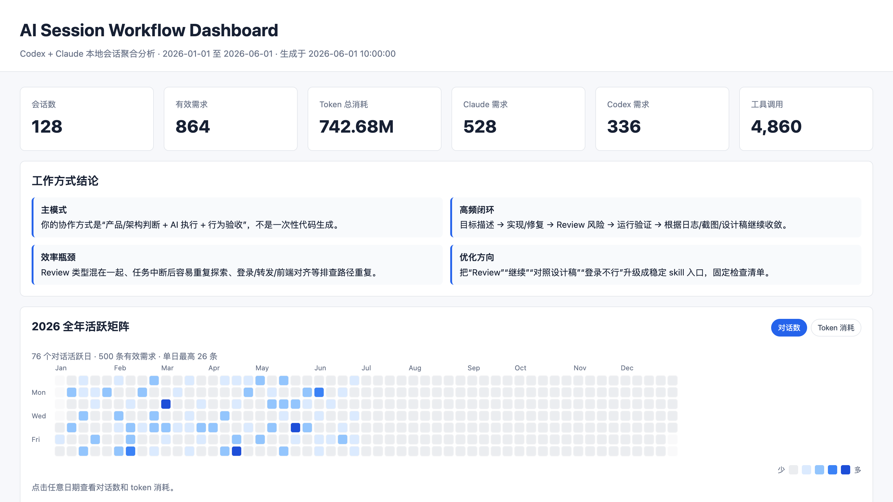

# Flow Lab

[中文文档](README.zh-CN.md)

Flow Lab is a local session analytics tool for AI coding agents. It parses local agent logs, extracts high-level activity signals, and generates a standalone HTML dashboard for reviewing work patterns, activity, token usage, language signals, and reusable skill opportunities.

The tool is designed for private, local analysis first. Generated dashboards can contain derived session content, prompt excerpts, local paths, project names, token totals, and other personal workflow metadata, so generated reports should not be committed to a public repository.

## 中文说明

Flow Lab 是一个本地 AI Coding Session 分析工具。它会读取本机 Code Agent 的会话日志，整理出工作方式、活跃度、token 消耗、任务类型、开发语言信号、工具使用情况，并生成一个可离线打开的 HTML 数据看板。

适合用来回答这些问题：

- 最近一段时间主要在做哪些类型的开发任务？
- Codex、Claude Code 等 Agent 的使用占比如何？
- 全年度活跃情况如何，哪几天对话数或 token 消耗最高？
- 从 session 内容推断，主要涉及哪些开发语言和技术栈？
- 哪些高频工作流适合沉淀成可复用 Skills？
- 如何优化和 AI Code Agent 协作的方式？

Flow Lab 默认只处理本地数据，不上传日志。生成的 HTML 可能包含 prompt 摘录、项目名称、本地路径、token 统计和工作习惯等敏感信息，因此真实看板默认不会提交到 Git。

## 示例预览

下面的截图由 mock 数据生成，不包含真实会话内容：



## Features

- Parse local Codex and Claude Code session logs.
- Generate a standalone HTML dashboard.
- Show yearly activity as a GitHub-style matrix.
- Switch the matrix between conversation count and token consumption.
- Click matrix cells to inspect the exact daily values.
- Summarize total sessions, effective prompts, token usage, tool calls, sources, projects, and inferred task categories.
- Infer development language distribution from session text signals.
- Surface workflow optimization suggestions and candidate skills.
- Apply best-effort redaction for common secret patterns before rendering excerpts.

## Quick Start

Run from the repository root:

```bash
python3 scripts/build_session_dashboard.py --output session_workflow_dashboard.html
```

Or run the skill-local script:

```bash
python3 skills/session-dashboard/scripts/build_session_dashboard.py --output session_workflow_dashboard.html
```

Then open the generated `session_workflow_dashboard.html` locally in a browser.

## Install As A Skill

The skill package is self-contained under:

```text
skills/session-dashboard/
```

To use it as a Codex skill, copy or symlink that directory into your Codex skills directory:

```bash
mkdir -p ~/.codex/skills
cp -R skills/session-dashboard ~/.codex/skills/session-dashboard
```

After installation, start a new Codex session and ask for tasks such as:

```text
Use the session-dashboard skill to generate my AI coding session dashboard.
```

```text
整理我的 Codex 和 Claude session，生成一个 HTML 数据看板，并统计 token 总消耗。
```

```text
根据本地 Code Agent 会话，分析我的工作方式、活跃矩阵、开发语言占比和可提炼的 skills。
```

The skill instructions tell the agent when to run the bundled script, how to interpret the output, and how to report the result.

## Use As A Script

You can also use Flow Lab without installing the skill:

```bash
python3 scripts/build_session_dashboard.py --output session_workflow_dashboard.html
```

Useful options:

- `--output <path>`: write the generated dashboard to a specific file.
- `--mock`: use public demo data instead of reading local session logs.

Generate the public example dashboard:

```bash
python3 scripts/build_session_dashboard.py --mock --output examples/mock-dashboard.html
```

The script currently has no third-party Python dependencies.

Expected local inputs:

- Codex sessions under `~/.codex/sessions/**/*.jsonl`
- Claude Code sessions under `~/.claude/projects/**/*.jsonl`

Expected output:

- A standalone HTML dashboard.
- A terminal JSON summary with session count, prompt count, token total, provider split, and date range.

## Supported Sources

Implemented adapters:

- Codex: `~/.codex/sessions/**/*.jsonl`
- Claude Code: `~/.claude/projects/**/*.jsonl`

Documented extension targets:

- Cursor
- OpenCode
- Trae
- VS Code agent extensions such as Cline, Roo, and Continue

See [agent-log-sources.md](skills/session-dashboard/references/agent-log-sources.md) for adapter notes and expected parser contracts.

## Privacy Notes

Flow Lab reads local session logs and produces a local HTML report. The generated report is intentionally ignored by Git because it may contain sensitive workflow metadata.

Before sharing any generated dashboard:

- Review prompt excerpts and project names.
- Check local paths, hostnames, URLs, and internal service names.
- Confirm token usage and activity patterns are acceptable to disclose.
- Treat built-in redaction as a helper, not a complete data-loss-prevention system.

## Skill Package

The reusable Codex skill lives in:

```text
skills/session-dashboard/
```

Main files:

- `SKILL.md`: agent-facing instructions, trigger cases, parsing rules, privacy rules, and final response format.
- `scripts/build_session_dashboard.py`: the dashboard generator.
- `references/agent-log-sources.md`: notes for implemented and planned provider adapters.

When extending the skill, keep `SKILL.md` focused on behavior and put provider-specific storage notes in `references/`.

## Development

The project currently uses only the Python standard library.

Run a smoke test:

```bash
python3 skills/session-dashboard/scripts/build_session_dashboard.py --output /tmp/session-dashboard.html
```

The output file is a local artifact and should not be committed.

Generate the committed mock example:

```bash
python3 scripts/build_session_dashboard.py --mock --output examples/mock-dashboard.html
```
